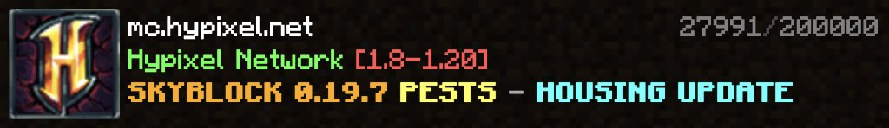

# Minecraft-Telegram-bot

## About

This is a basic server telegram bot that can interface with minecraft servers in a couple of ways:

- ping public facing servers and get info
- control local minecraft server
- control local whitelist.json files
- TODO control local blacklist.json files?
- TODO control server.properties settings?

This bot is not a plugin or a mod, it is a standalone python program. If setup local to your minecraft servers it'll have access to their consoles through tmux (see setup instructions and details below). This also means that it could be used for basically any version of minecraft. I plan to use it to manage 3 servers of differing versions at once.

## Interface overview

There are some nice visuals the bot provides:

- The `/status` command mimics the minecraft launcher, rendered using the `html2image` package:
  
- The `/whitelistadd` command renders the user's skin with [NickAc's Minecraft Skin Renderer](https://nmsr.nickac.dev/) so you can be sure you've added the right person:
  
- The `/online` command is planned to render the users like a tablist, likely using the `htm2image` package

## Setup

### Python enviroment

I would reccomend using this in a venv since there are some cluttersome packages:

```bash
python3 -m venv .venv
source .venv/bin/activate
pip install -R requirements.txt
```

### Hosts json file

An array of your saved hosts.

```json
[
  {
    "name": "My Minecraft Server",
    "hostname": "my.minecraft.server.com",
    "port": 25565,
    "local": true,
    "whitelist_path": "/srv/minecraft/whitelist.json",
    "systemctl_name": "minecraft",
    "tmux_name": "minecraft"
  },
  {
    "name": "Hypixel",
    "hostname": "mc.hypixel.net",
    "port": 25565,
    "local": false,
    "whitelist_path": "",
    "systemctl_name": "",
    "tmux_name": ""
  }
]
```

Values:

- `name`: The pretty name visible by default to commands like /status.
- `hostname`: The ip address of the server (can use localhost, but it wont display the external facing ip when you ask for it)
- `port`: The port the server is running on, will be displayed if is non default when prompted for the hostname.
- `local`: True if this server is local
- `whitelist_path`: Path to the whitelist.json file for this local server
- `systemctl_name`: Service name of the server
- `tmux_name`: Name of the tmux session your server runs in.

### .env

```bash
# telegram bot config
DEVELOPER_CHAT_ID = "DEV_CHAT_ID"
TOKEN             = "TELEGRAM_BOT_TOKEN"
WHITELIST_PATH    = "./tmp.json"

# default minecraft server config
SERVER_HOST = "host.name"
SERVER_PORT = 25565
```

Values:

- `DEVELOPER_CHAT_ID`: chat id where you want errors sent
- `TOKEN`: telegram bot token
- `SERVER_HOST`: hostname of the default server
- `SERVER_PORT`: port of the default server

### Local setup

As mentioned earlier, for the bot to have control over the server it has be run locally (on the same computer) and the server needs to be setup as described below.

This isn't neccessary if you only want the whitelist functionality though, as that directly edits your whitelist.json for simplicity.

In the below setup we let `servername` be the name of the server (one_word). Note that this is the value to use in the host config file for `systemctl_path` and `tmux_name`. If there are multiple servers on the local system you want to manage with the bot make sure the names are different...

#### tmux

We will run the minecraft server in a tmux session so we can interface with it at any time. If you don't have tmux you can install it with:

```
sudo apt get tmux
```

To access the server command prompt yourself use `tmux attach -t servername` after you setup and start the server as instructed below.

#### systemd

We now want to make a service file, to launch our tmux session and start the minecraft server. Create the below files:

- `/etc/systemd/servername.service`:

  A service file to let systemd know what to do. ExecStop can be improved for sure, as I usually avoid long bash operations like this.

  `User` and `Group` should be set to the minecraft admin account, and `WorkingDirectoy` should be a path to the server folder.

  After properly setting up this file the server can be started with `systemctl start servername` and stopped with `systemct stop servername`. To start the server automatically whenever the computer is on run `systemctl enable servername`. This only needs to be done once
  


  ```
  [Unit]
  Description=Launch a Minecraft server in a tmux session
  After=local-fs.target network.target

  [Service]
  WorkingDirectory=/home/mineadmin/minecraft/server
  User=mineadmin
  Group=mineadmin
  Type=oneshot
  ExecStart=tmux new -s minecraft -d && tmux send-keys -t minecraft "./start.sh" Enter
  RemainAfterExit=true
  ExecStop=tmux send-keys -t minecraft stop Enter && export PID=`cat server.pid` && while ps -p $PID > /dev/null; do sleep 1; done && tmux kill-session -t minecraft
  StandardOutput=journal

  [Install]
  WantedBy=multi-user.target
  ```

- `/home/mineadmin/minecraft/server/start.sh`:
  helper script for starting the server and saving the pid

  ```bash
  java -Xms1024M -Xmx4G -jar server-x.x.x.jar nogui &
  echo $$ > server.pid
  ```

  make sure to make `start.sh` executable with

  ```
  chmod +x start.sh
  ```

### Other

This project uses the `html2image` package, which uses a browser in headless mode to render html. This means you need a browser like chrome installed on the server computer.

## Commands

- `/online hostname`:
  TODO
  Check what players are online (obsfucated by some servers)
- `/status [hostname...] -a,--all -h,--hostname`
  Check server(s) status, renders motd like in the minecraft launcher.
  - `-a`, `--all`: show all of the hosts in your hosts file.
  - `-h`, `--hostname`: show hostnames instead of pretty names.
    d
- `/ping hostname`:
  Measure the response time of the server.

### Admin commands

- `/serverstop`:
  TODO
  Stop the server
- `/serverstart`:
  TODO
  Start the server
- `/serverrestart`:
  TODO
  Restart the server
- `/whitelistadd username`:
  Add player to the whitelist
- `/whitelistrm username`:
  Remove player from the whitelist
- `/activate hostname`:
  Set active server for general commands

### General admin commands:

Any command that is not reconized will be sent directly to the active server console via tmux
